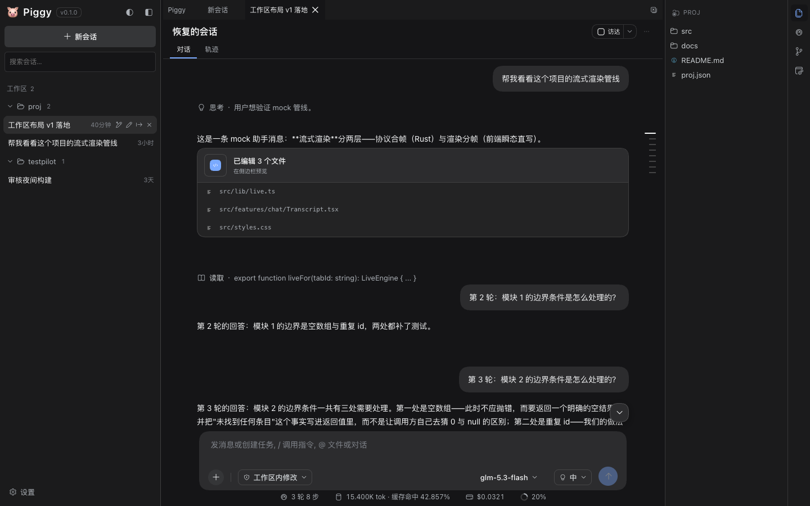
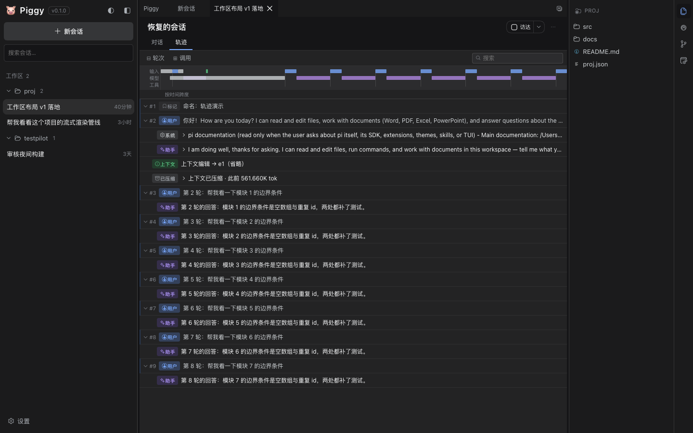
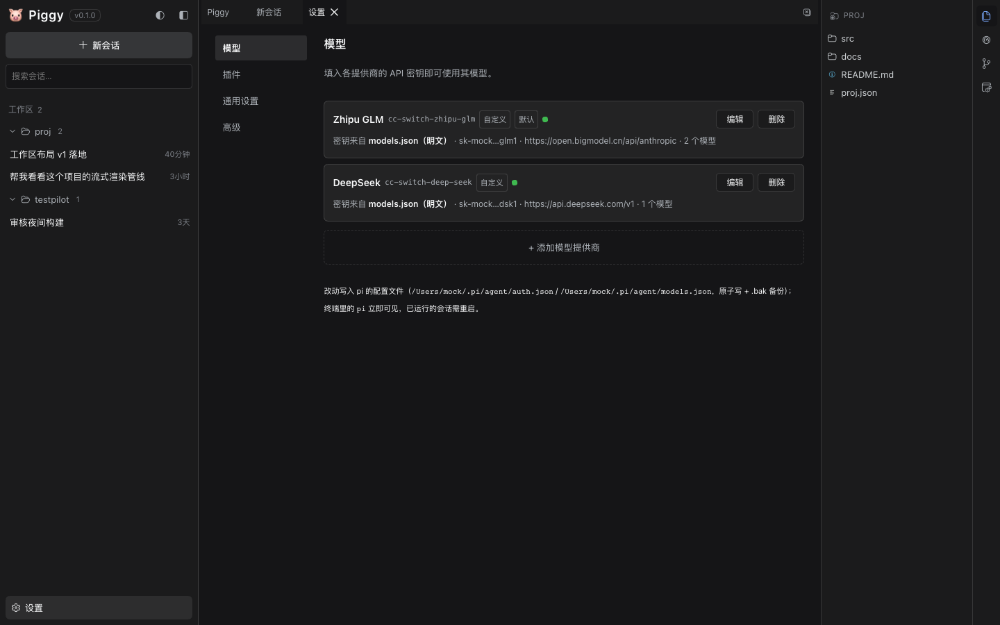

# Piggy 🐷

**pi 的图形驾驶舱** —— 以 [pi](https://github.com/earendil-works/pi) 为引擎、**Tauri 2** 为壳、
**pi RPC mode** 为集成协议的桌面 GUI Agent。

Piggy 不复制 pi 的大脑，只做它的宿主：为每个会话管理一个真实的 `pi --mode rpc` 子进程，
监督、转发、呈现它的全部事件。因此**与 pi CLI 完全同构**——同一个会话文件、同一份
`~/.pi/agent` 配置：GUI 里开的会话可以随时 `pi -c` 在终端续跑，反之亦然。



<p align="center">
  
  
</p>

> 配图由 `pnpm --filter @piggy/desktop ui:shot` 在 **mock IPC** 下生成（浏览器 + 假后端，
> 不需要 pi、不碰真实会话），可原样重跑——见 [§ 重新生成配图](#重新生成配图)。

---

## 为什么不是"再写一个 agent"

终端形态对四件事不友好，这也正是 Piggy 存在的理由（docs/00 §2）：

1. **并行多会话**——多个项目、多个任务同时在跑，TUI 得开一堆终端窗格；
2. **结构化数据**——会话分支树、token/成本曲线、工具调用 diff、子代理舰队状态，纯文本信息密度太低；
3. **配置管理**——`auth.json` / `models.json` / `settings.json` 都是手编 JSON；
4. **桌面级体验**——全局唤起、托盘、通知、剪贴板与拖拽图片、可改绑的快捷键体系。

## 现在能做什么

| 域 | 能力 |
|---|---|
| **会话** | 侧栏按工作区分组 + 搜索 + 相对时间；新建 / 恢复 / 重命名 / 删除 / 导出 HTML / fork / clone；缺失 cwd 的会话收进底部折叠桶并可批量清理 |
| **转录** | 虚拟化渲染；**分页读会话文件**（一页 = 50 行且 5 轮，上限 300 行 / 1 MiB）；打开即落在结尾；向上「加载更早」、向下自动续页；点刻度梯**换窗**跳转任意一轮（一次跳转只读一页）；「回到最新」/「继续往下」 |
| **预览滚动条** | DSH `TurnNavigator` 同款刻度梯：吃**整段会话的轮次轮廓**（一次扫描，只解析约 17% 字节），未载入的刻度暗显、点了先翻页；三态开关（左/右/关） |
| **流式** | 合帧 ≤60Hz + 实时块直写 DOM；贴底跟随（`>25px` 才认为读者接管）；`Esc` 中断并把草稿还原回输入框；队列 chips（steer / follow-up） |
| **上下文压缩** | 手动 `/compact` 与阈值自动压缩；压缩行带摘要、压缩前 token、**保留边界**、涉及文件、摘要调用用量；轨迹里的压缩细节可展开；失败/中断如实标注（不说成"完成"） |
| **工具与产物** | 工具调用是**一行 24px 的窄行**（`运行命令 · pnpm test`，摘要取自调用参数；DSH `DisclosureRow`/`ToolRow` 同款几何），展开才是代码卡片：diff 逐行底色、按需语法高亮（shiki，语言 LRU ≤ 16）、行数/复制/超高展开；另有本轮变更文件卡 |
| **窄行折叠** | 工具行与思考行默认折成 24px 一行（改前一个 6 行 `read` 结果占 258px）；正文用 `hidden="until-found"` 留在 DOM 里，**Ctrl+F 能搜到、复制拿得到**，展开一次点最前面的图标/空白即可 |
| **模型 / Provider** | 提供商配置页（列表 / 编辑 / 检测连通性 / 获取可用模型）；模型与 thinking 级别切换；三文件表单 + 原始 JSON 编辑器 |
| **插件** | 按 pi 的加载优先级分四组盘点；装 / 删 / 升级 / 启停；每行写明状态依据与路径 |
| **子代理** | 宿主侧 Fleet 编排（4 个内置模板、DAG 调度、lane 状态机、提升为标签页、steer）+ `piggy-bridge` 桥接 pi-subagents（`PIGGY:1:` 数据面 + 未安装时降级说明） |
| **轨迹** | 全事件流（按轮次分组、角色芯片、工具行可展开、搜索）+ 三轨时间线（输入 / 模型 / 工具） |
| **工作区** | dockview 编辑区（预览 / 固定 / 徽标）、Monaco 实例池（水位 6，切回自动重建）、右栏文件树 / 统计 / 会话树 / Fleet、布局持久化跨重启 |
| **桌面** | 托盘、全局唤起（`Cmd/Ctrl+Shift+P`）、崩溃安全（panic 转储）、空闲回收（默认 10min 可配）、worker 上限（默认 8，超限给"回收最闲"）、休眠标签（保留游标、唤醒透明） |
| **外观 / 输入** | VS Code 主题（tokenColors 同步）、codicons + Seti 图标、暗/亮；命令面板（`Cmd+K`）、快捷键可改绑 + 冲突检测、内建斜杠命令 |
| **权限** | 三档：仅可查看 / 工作区内修改（含守卫扩展 `piggy-guard.js`）/ 完全权限；切档 = 带同一会话文件重启 worker |

细节与设计理由见 [docs/](docs/README.md)；每条的落地记录与实测数字见
[docs/09-roadmap.md](docs/09-roadmap.md)、[docs/15-handoff.md](docs/15-handoff.md)。

## 环境要求

| | 要求 |
|---|---|
| Node | ≥ 20（本仓开发用 24） |
| pnpm | ≥ 10（`packageManager` 锁 11.24.0） |
| Rust | stable（Tauri 2 工具链） |
| **pi** | **契约锚定 0.87.1**。发现顺序：设置里的显式路径 → `PI_BIN` → 应用内置（full SKU 捆绑的官方 standalone）→ `PATH`。启动时跑 `pi --version` 做版本门禁 |
| 可选 | 浏览器（只跑前端门禁/截图时需要）：`ui:debug` / `ui:startup` / `ui:shot` 用系统 **Chrome**（`channel:'chrome'`），`perf` 用 Playwright 自带的 **chromium**（`pnpm exec playwright install chromium`）。**不需要**为了跑前端而装 pi——浏览器里跑的是 mock IPC |

## 快速开始

```bash
pnpm install

pnpm tauri dev            # 桌面应用（会自己拉起 Vite）
# 或者只跑前端：pnpm dev  → http://localhost:5195（mock IPC，无需 pi，可完整点界面）
```

打包（默认 lite SKU，不捆绑 pi）：

```bash
pnpm tauri build
```

full SKU（捆绑官方 standalone pi，最终用户零前置安装）：

```bash
pnpm --filter @piggy/desktop exec node scripts/fetch-pi-standalone.mjs   # 下载 + SHA256 校验 → resources/pi/
pnpm tauri build --config src-tauri/tauri.full.conf.json
```

> 捆绑 pi 是**再分发**别人的作品：MIT 声明必须随包走（`src-tauri/resources/pi-LICENSE.txt`），
> 一致性由 `src/test/license.test.ts` 锁住。详见 [docs/17](docs/17-pi-permissions-and-packaging.md) §2.7。

## 常用命令

```bash
pnpm dev                                          # Vite :5195（mock IPC）
pnpm test                                         # vitest：前端 + 协议包 + 桥接扩展
pnpm test:rust                                    # Rust 单元 + fixtures 对拍 + IPC 契约
pnpm test:contract                                # 对**真实 pi** 的契约测试 C1–C14（走已配置 provider，消耗少量 token）
pnpm typecheck                                    # tsc（apps/desktop + packages/piggy-bridge）
pnpm build:bridge                                 # 桥接扩展源码 → resources/piggy-bridge.js（改扩展后必跑）

pnpm --filter @piggy/desktop ui:debug             # 截图 + console 错误 + 布局体检（--strict 给 CI 用）
pnpm --filter @piggy/desktop ui:debug -- --strict
pnpm --filter @piggy/desktop ui:startup           # 真布局门禁（Playwright，12+ 段，见下）
pnpm --filter @piggy/desktop perf:lite            # 性能冒烟 S1/S3（预算不过 exit 1）
pnpm --filter @piggy/desktop perf                 # 全场景 S1–S6
```

## 质量门禁

每个门禁都**先证明它抓得住 bug**（把实现改坏，确认断言变红），再谈通过。

| 门禁 | 覆盖 | 最近一次实测 |
|---|---|---|
| `pnpm typecheck` | apps/desktop + packages/piggy-bridge（后者对着真实 pi 类型） | ✅ |
| `pnpm test` | 前端 441（47 文件）+ 桥接 37 + 协议 30 | ✅ **508 passed** |
| `pnpm test:rust` | Rust 单元 308 + fixtures 3 + IPC 契约 19 + 路径纪律 2；另 7 条 `#[ignore]` 真机核对 | ✅ **332 passed / 7 ignored** |
| `pnpm test:contract` | 对真实 pi 0.87.1 跑 C1–C14（含桥接数据面、降级、两 lane DAG） | ✅ **347 passed**（其中对真实 pi 的 15 项耗时 41s） |
| `cargo clippy --all-targets -- -D warnings` | 含 test 目标（只跑 lib 会漏掉 5 处旧提示，已修） | ✅ |
| `pnpm build` | tsc + vite 产物 | ✅ |
| `ui:startup` | 真浏览器 + mock：布局恢复一致性、Fleet A/B 两层、斜杠补全真滚动、代码块真高亮、文件预览按需语言包、折叠侧栏、空编辑区、打开方式（会话/文件）、Monaco 池、提供商页、会话标题、**分页几何**（打开即贴底 / 翻页不跳 / 换窗跳转 / 继续往下 / 滚轮续页）、**数字口径**、**压缩细节** | ✅ 全部通过 |
| `ui:debug --strict` | 零 pageerror / 零 console error / 零布局问题 | ✅ 0/0/0 |
| `perf:lite` | S1 流式帧率与长任务、S3 万条消息打开与滚动（预算见 docs/05 §2） | ✅ S1 **60fps / 0 longtask**；S3 hydrate **34ms** / 1 longtask |

**已知不绿的两格**（不想让它们躲在表格外，详见 [docs/15](docs/15-handoff.md) §4）：

- `cargo fmt --check` —— 仓库里没有 `rustfmt.toml`，现有 Rust 代码按 ~120 列手写，格式化检查一直红
  （CI 的 `rust` 作业因此整体是红的：**不是代码有问题，是这一格从未通过**）；
- `pnpm lint` —— 没有任何包定义 `lint` 脚本，`pnpm -r --if-present lint` 一个文件都扫不到
  （手工 `npx eslint .` 存量 189 error / 35 warning，含把构建产物当源码扫的问题）。

另外，**UI 门禁（`ui:startup` / `ui:debug --strict`）只在本机跑**：它们需要 Chrome 与一个
:5195 的 dev server，目前没有对应的 CI 作业（要接就得先在 runner 上确认真的绿过）。

### 重新生成配图

```bash
pnpm dev   # 另开一个终端，保持运行
cd apps/desktop
node scripts/shot.mjs ../../docs/screenshots/chat.png       --fresh --wait 2500 \
  --click .pg-session-row --eval "document.querySelector('.pg-transcript').scrollTop = 0"
node scripts/shot.mjs ../../docs/screenshots/trajectory.png --fresh --wait 2500 \
  --click .pg-session-row --click ".pg-ws-tab:nth-of-type(2)" --wait 1200
node scripts/shot.mjs ../../docs/screenshots/settings-providers.png --fresh --wait 2500 \
  --click .pg-sidebar-settings --wait 1500
```

`--fresh` 会清掉 localStorage + sessionStorage——截图必须是**冷启动**的样子，
否则上一轮门禁留下的标签会跟着进画面。

## 仓库结构

```
apps/desktop/            Tauri 2 应用
  src/                   前端（React 19 + Vite 7 + zustand/immer + antd 6 + dockview + Monaco）
    features/chat/       转录、Composer、预览滚动条、轨迹（本仓 UI 的核心）
    features/workspace/  布局、侧栏、右栏、编辑区
    features/settings/   提供商 / 通用 / 高级 / 插件
    stores/              tabs / messages / trajectory / fleet / stats / dialogs / ui
    lib/                 ipc、paging、tokenFormat、resizeWatch、slashCommands、mock 后端…
  src-tauri/             Rust 核心
    src/pi/              discovery、codec、process（状态机）、protocol（透传）、合帧器
    src/sessions/        registry（多 worker / 回收 / 休眠）、list、transcript（分页读）
    src/fleet.rs         子代理 A 层（DAG 调度、lane 状态机、worktree）
    src/fs_guard.rs      快捷编辑的子树校验与 mtime 冲突语义
    resources/           守卫扩展、桥接扩展产物、捆绑的 pi
  scripts/               ui:startup / ui:debug / ui:shot / perf-run / 资源同步脚本
packages/pi-protocol/    pi RPC 协议的 TS 类型 + Rust↔TS 对拍 fixtures
packages/piggy-bridge/   pi 扩展：把 pi-subagents 桥到 GUI（`PIGGY:1:` 数据面）
docs/                    设计文档（SSOT）+ screenshots/
.github/workflows/       ci（frontend / rust / contract / perf-lite 四个作业）+ perf-nightly（全场景 S1–S6）
```

## 文档

[docs/README.md](docs/README.md) 是完整地图（00–18，含推荐阅读路径）。几条最常用的：

| 想了解 | 看 |
|---|---|
| 愿景、目标/非目标、用户故事 | [docs/00](docs/00-overview.md) |
| 进程模型与数据流 | [docs/01](docs/01-architecture.md) |
| pi RPC 对接（命令/事件/容错） | [docs/02](docs/02-pi-rpc-integration.md) |
| 模块划分与接口约定 | [docs/03](docs/03-module-design.md) |
| 前端架构与流式渲染管线 | [docs/04](docs/04-frontend-design.md) |
| DSH UI 的逐条源码规格（`file:line`） | [docs/12](docs/12-dsh-ui-spec.md) |
| 一页交接：状态 / 踩过的规矩 / 未完成项 | [docs/15](docs/15-handoff.md) |
| 权限档位与自定义打包 | [docs/17](docs/17-pi-permissions-and-packaging.md) |

**文档纪律**：行为变更必须同时改文档；文档里写的门禁必须真的跑得起来（本轮就修掉了两处
"写着在跑、其实从没跑过"的地方：perf-lite 的 CI 路径与它的就绪探针）。

## 已知限制

诚实清单——这些**没有**验证过或**没有**做完，别按"已支持"理解：

- **Windows / Linux 未真机验证**：系统菜单、`C:\…` 路径渲染、`pi.cmd` 发现都只有静态断言与模拟证据；
- **自动更新未接**：`tauri-plugin-updater` 已注册，但 `tauri.conf.json` 仍指向占位域名与空 pubkey（需更新源 + 签名密钥的产品决策）；
- **打包签名未配**：macOS notarization / Windows signing 需要证书；full SKU 的下载与校验脚本已就绪；
- **登录内嵌终端**：真 PTY 通路与命令回显已实测（pty ×3），但 `pi /login` 的 **OAuth 全流程没在真机跑过**；
- **没有 tauri-driver 实机 E2E**：当前是 Playwright + mock 前端门禁 + Rust 真进程测试的组合；
- **Linux webkitgtk** 的性能预算未锁（平台降级为 P2）；
- **i18n 只有骨架**：zh-CN 已接、en-US 词典在，切换 UI 与全量文案迁移是持续项；
- **预览滚动条只在 Chrome / Chromium（Playwright）里量过**：WebKit 的 `mask-image` 差异未验证；
- 上面两格不绿的门禁（`cargo fmt --check`、`pnpm lint`）。

## 隐私

**Piggy 自身零遥测**——不引入任何分析 SDK，不上报任何东西（docs/08 §4）。
API Key 只存在于 pi 自己的 `~/.pi/agent/auth.json`，Piggy 不存储、不读取明文密钥
（设置页只显示"已配置"与密钥来源）。本机落盘只有：性能配置 `~/.piggy/config.json`、
布局与偏好（localStorage）、以及崩溃时的 panic 转储 `~/.piggy/logs/`。

> pi 自身有一个**安装遥测**开关（`PI_TELEMETRY` 或 `settings.json` 的 `telemetry`）——
> 那是 pi 的行为，Piggy 不代为改写、也不隐藏它。要关就在 pi 的设置里关。

## 授权

Piggy 是自由软件，按 **GNU 通用公共许可证第 3 版（或任何更新版本）** 发布：
SPDX 标识 `GPL-3.0-or-later`。完整条款见 [LICENSE](LICENSE)（GPLv3 原文，逐字节取自
<https://www.gnu.org/licenses/gpl-3.0.txt>，未做任何改动）。

```
Piggy —— pi 的图形驾驶舱
Copyright (C) 2026 wxk6b1203

本程序是自由软件：你可以按自由软件基金会发布的 GNU 通用公共许可证条款
（第 3 版，或你选择的任何更新版本）重新分发和/或修改它。

本程序的分发是希望它有用，但**没有任何担保**，甚至没有适销性或特定用途适用性的
默示担保。详见 GNU 通用公共许可证。

你应该已经随本程序收到一份 GNU 通用公共许可证的副本；如果没有，见
<https://www.gnu.org/licenses/>。
```

**第三方组件**：Piggy 复用/分发了若干上游资产（VS Code codicons 与主题 tokenColors、
seti-ui 图标、Monaco，以及 full SKU 捆绑的 **pi** 本体），各自的许可与署名义务登记在
[THIRD_PARTY_NOTICES.md](THIRD_PARTY_NOTICES.md)。这些组件的许可（MIT / CC-BY-4.0）
都与 GPLv3 兼容，但**署名必须保留**——新增可复用资产时按该文件的约定登记。
GPL §5(d) 要求的交互界面声明在应用内：「关于 Piggy 与许可」对话框（macOS 在 App 菜单、
其它平台在 Help，也可从命令面板或侧栏版本号打开），内含第三方组件表与 GPLv3 全文；
`src/test/license.test.ts` 锁住这几处的一致性。

> 注意：GPL 是**传染性**许可。分发修改版（含打包好的安装包）时，必须一并提供
> 对应的完整源码；同时不得给下游附加更严格的条款。
