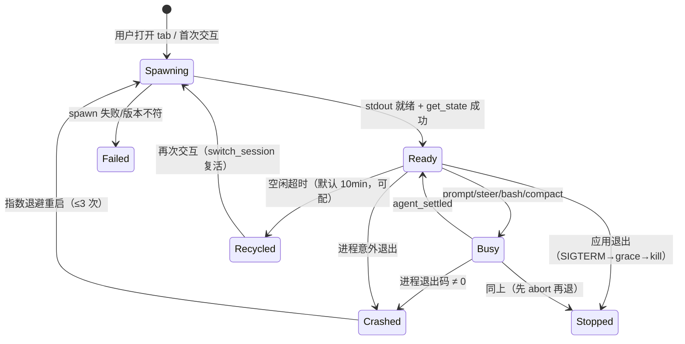
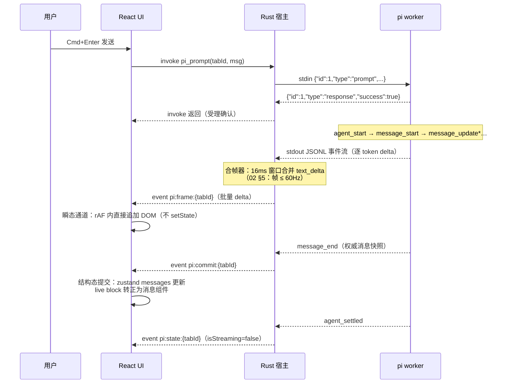

# 01 · 整体架构与技术选型

> 上游：[00-overview.md](00-overview.md) · 下游：[02-pi-rpc-integration.md](02-pi-rpc-integration.md)、[03-module-design.md](03-module-design.md)

## 1. 架构总览

三句话概括：**Piggy 是三层结构——Rust 宿主层管进程与文件，React 表现层管界面，pi 进程层干活**。宿主与 pi 之间是 JSONL stdio（RPC mode）；宿主与界面之间是 Tauri IPC（invoke + event）。所有 LLM 交互、工具执行、会话持久化都发生在 pi 进程内，Piggy 只做监督、转发、呈现与配置。

```mermaid
flowchart TB
    subgraph WebView["WebView（GPU 合成）"]
        UI[React 19 + React Compiler<br/>antd 6 + 自研转录渲染器]
        Store[zustand stores<br/>结构态 | 瞬态双通道]
    end

    subgraph Rust["Tauri 2 主进程（Rust, tokio）"]
        CMD[commands/<br/>IPC 命令层]
        SUP[pi/ 进程监督器]
        COA[pi/coalesce 合帧器]
        REG[sessions/registry<br/>tab ↔ worker ↔ 会话文件]
        LIST[sessions/list<br/>会话文件扫描 + fs watch]
        CFG[config/<br/>auth.json · models.json · settings.json]
        FLEET[fleet/ 舰队编排]
        EVT[events/ 前端事件总线]
    end

    subgraph PiProc["pi 进程层（Node，每标签页 0..1 个）"]
        W1["worker A<br/>pi --mode rpc<br/>cwd=项目X"]
        W2["worker B<br/>pi --mode rpc<br/>cwd=项目Y"]
        W3["worker C（Fleet 子代理）"]
    end

    UI <-->|"invoke 命令（请求/响应）"| CMD
    EVT -->|"event 推送（合帧后流）"| Store
    CMD --> SUP & REG & CFG & FLEET
    SUP --> W1 & W2 & W3
    LIST --> REG
    W1 & W2 & W3 -->|"stdout: JSONL 事件/响应"| COA --> EVT
    CFG -.->|"原子写 + 备份"| FS[("~/.pi/agent/<br/>auth.json · models.json · settings.json")]
    LIST -.-> FS2[("~/.pi/agent/sessions/<br/>**.jsonl（树结构）")]
    W1 & W2 & W3 -.-> FS2
```

要点：

- **pi 进程不常驻**：按需 spawn、空闲回收（05 §4），一个标签页最多一个 worker；
- **会话列表不依赖进程**：Rust 直接扫描会话文件目录 + 解析每文件首行 SessionHeader（02 §6.3），冷启动零 pi 进程；
- **配置即文件**：Provider/模型/设置全部落在 pi 的标准文件上，GUI 只是这些文件的一个受控编辑器（00 G7 双向互通的根基）。

## 2. 进程模型

### 2.1 进程清单

| 进程 | 数量 | 生命周期 | 职责 |
|------|------|----------|------|
| Piggy 主进程（Rust） | 1 | 应用全程 | 窗口、IPC、进程监督、配置、舰队、托盘、全局快捷键 |
| WebView 渲染进程 | 1 | 应用全程 | React UI（系统 WebView，GPU 合成） |
| pi 会话工作进程 | 0..N（默认上限 8，可配） | 按需 spawn → 空闲 10min 回收 → 需要时复活 | 单个会话的全部 agent 工作 |

### 2.2 会话工作进程绑定规则

1. **一个标签页（tabId）同一时刻至多绑定一个 worker**；worker 退出后 tabId 保留，下次交互时复活（`switch_session` 到原会话文件，02 §7.5）。
2. **一个会话文件至多被一个 worker 打开**（registry 强制互斥）：pi 会话是 append-only JSONL 树，双开有写冲突风险。
3. **worker 的 `cwd` = 该 tab 的项目目录**：pi 以 cwd 发现项目资源（`.pi/`、`AGENTS.md`、skills）并决定会话存储路径。跨项目切换 = 关闭当前 worker、spawn 新 worker（见 03 §2.3 状态机）。
4. **临时草稿会话**：`--no-session`，关闭即弃，不进入会话列表。

### 2.3 生命周期状态机（worker）



- **优雅退出**：先发 `abort`（若 Busy）→ 等待 `agent_settled` 或 2s 超时 → SIGTERM → 3s 宽限 → SIGKILL。pi 的会话文件是即时 append 的，强杀只可能丢"最后一口气"的增量，不损坏文件（02 §7.5 的游标恢复负责补齐）。
- **崩溃恢复**：重启后 `switch_session` 回原文件，用 `get_entries(since=lastCursorId)` 增量补齐 UI（对话内容不丢，正在进行的生成丢失是预期行为）。

## 3. 关键选型与理由

### 3.1 Tauri 2（vs Electron / 纯原生）

| 维度 | Tauri 2 | Electron | 结论 |
|------|---------|----------|------|
| 内存 | 复用系统 WebView（macOS WKWebView / Windows WebView2 / Linux webkitgtk），空载开销约为 Electron 的一半以下 | 每应用独占一份 Chromium + Node，基线 150–300MB | Piggy 目标 G3 决定性优势 |
| CPU/能耗 | 无常驻 V8/Node 主进程；Rust 侧 tokio 极低空转 | Node 主进程常驻 | G3 |
| GPU | WKWebView 走 Metal 合成、WebView2 走 DirectComposition，均为 GPU 合成 | Chromium 自带 GPU 进程，同样 GPU 合成 | 打平，均满足 G4 |
| 进程管理 | Rust 一等公民：spawn/pipe/signal、tokio 异步管道，正是本项目的核心负载 | 需要 child_process + 原生模块补丁 | **pi 子进程监督是本项目的第一职责**，Rust 是最合适的宿主语言 |
| 体积/更新 | 安装包小，自带 updater 插件 | 大 | 次要优势 |
| 劣势 | Linux webkitgtk 兼容性与性能弱于 Chromium；多 WebView 行为有平台差异 | 一致 | 接受：首发优先 macOS/Windows，Linux 为 best-effort（00 NG5） |

**结论**：本项目的主职（监督多个 stdio JSONL 子进程 + 低资源常驻）与 Tauri 的形态精确匹配。

### 3.2 pi RPC mode（vs pi SDK 内嵌 / 自研 agent）

pi 官方给出两条集成路径：SDK（同进程 Node 库）与 RPC（子进程 JSONL）。官方文档明确："RPC mode is preferred when: you're integrating from another language, you want process isolation, you're building a language-agnostic client"——Piggy 三条全占。

| 维度 | RPC 子进程 | SDK 内嵌（Node sidecar） |
|------|-----------|--------------------------|
| 隔离性 | pi 崩溃/内存膨胀不影响 GUI；worker 可独立回收重启 | sidecar 崩溃仍需宿主兜底，且失去"每会话一进程"的自然粒度 |
| 版本耦合 | pi 独立升级（npm 全局），Piggy 只依赖稳定文档化协议 | 依赖 SDK API 语义，编译期耦合版本 |
| 宿主语言 | Rust（与 Tauri 同体） | 必须在应用内隐藏一个 Node 运行时，且要自己复刻 session runtime 管理 |
| 能力面 | 全部用户可见能力（02 §4–§6）；扩展 UI 子协议齐备 | 更深（如自定义 ResourceLoader） |
| 性能 | stdio 本地管道，JSON 序列化开销可忽略（02 §5 合帧后 <1MB/s 量级） | 同进程调用略快，但差距无关紧要 |

**结论**：RPC 是正确层级——Piggy 需要的全部能力（对话、模型、会话树、压缩、扩展 UI、子代理）都在协议里；SDK 的深度定制能力不是桌面壳的需求。协议演进风险由 02 §9 契约测试 + 未知字段透传兜底。

### 3.3 Vite + React 19 + React Compiler

- **Vite**：Tauri 官方模板默认链，HMR 快，生态成熟。
- **React 19 + React Compiler**：本项目前端的核心矛盾是**高频流式更新 vs 渲染开销**。React Compiler 在编译期自动插入 memoization，普通组件无需手写 `useMemo/useCallback` 即可获得细粒度跳过渲染——这直接服务于 G4/G3（05 §3.4）。构建上采用 `@vitejs/plugin-react` + `babel-plugin-react-compiler`（官方文档路径）。
- **不引入 SSR/Next 等框架**：桌面 WebView 单页，无服务端渲染诉求。

### 3.4 antd 6 + 自研渲染器的双轨制（“分帧”的 UI 侧根基）

**结论：antd 只用于应用壳与低频界面（设置、表单、侧栏、弹窗、舰队面板）；会话转录流（transcript）用自研轻量渲染器**，antd 组件不进入逐消息渲染路径。

理由：

1. antd 组件（Card/Table/Tooltip 等）单实例成本高（Portal、弹层、监听），乘以数千条消息不可接受；
2. 转录流需要的虚拟化窗口、流式 DOM 追加、`content-visibility` 优化需要完全的 DOM 控制权（04 §4–§5）；
3. **antd v6（≥6.6）与本项目技术栈高度适配**：React 19 原生支持（v5 补丁包已移除）；**CSS 变量模式成为默认**（v5 需显式 `cssVar:true`，v6 起纯 CSS 变量架构，运行时样式成本大幅下降）；官方 dist 已预编译 React Compiler 产物，与我们的 React Compiler 全家桶同向；仅现代浏览器（系统 WebView 三平台均满足）。

**VS Code 形态优先原则**：antd 默认视觉语言（圆角、阴影、品牌色、中密度）与 VS Code 工作台形态冲突时，一律以 VS Code like 为准——全部 design token 由 VS Code 主题派生覆写（10 §2.4“一份四吃”），token 调不平的场景改用自研件（裁决表见 04 §6）。

### 3.5 状态管理：zustand 双通道

- **结构态**（消息列表、会话元数据、设置）：zustand store + immer，selector 细粒度订阅；React Compiler 保证组件级跳过。
- **瞬态**（流式 delta、工具执行增量）：`subscribe` 直连 DOM 写入（不触发 React 渲染），仅在块/消息边界（`*_end` 事件）提交结构态。这是 60fps 流式的关键（04 §4.3、05 §3.3）。

不选 Redux（样板与运行时开销对桌面单机无收益）、不选纯 Context（更新粒度失控）。

### 3.6 其余依赖（最小集）

| 用途 | 选择 | 备注 |
|------|------|------|
| 虚拟列表 | TanStack Virtual | headless，可配合自研渲染器 |
| Markdown | unified/remark 生态 + rehype-sanitize + 流式安全的分段渲染（04 §5） | 代码高亮 Shiki 按需动态加载（05 §5） |
| 终端仿真 | xterm.js（仅 Provider OAuth 登录流程与后期直连终端，06 外的独立特性） | portable-pty（Rust）供给 |
| Tauri 插件 | global-shortcut、updater、dialog、opener、clipboard-manager、fs（受限 scope） | 最小权限集，见 08 §6 |

## 4. 数据流（一次流式对话的完整路径）



设计原则：

1. **受理与完成分离**：`prompt` 的 invoke 在 pi 返回 `response.success=true` 后即返回（"已受理"），真正的完成由 `agent_settled` 事件表达——与 RPC 协议语义严格一致（02 §4.1）。
2. **一帧一事件**：Rust 对前端只暴露合帧后的 `pi:frame:*`（增量）与低频生命周期事件，WebView 的消息处理量与 token 速率解耦。
3. **权威快照终态化**：流式期间的一切 DOM 追加都是"预览"，`message_end.message` 才是入 store 的权威数据（协议文档明确 "Treat message_end.message as authoritative"）。

## 5. 安全模型（摘要）

1. **能力最小化**：Tauri capabilities 只授予所需权限；fs scope 限定在 `~/.pi/` 与用户显式选择的项目目录（08 §6）。
2. **密钥不出域**：API Key/OAuth token 只存在于 pi 自己的 `auth.json`；Piggy 的自有配置不含任何密钥；UI 呈现密钥时脱敏。
3. **内容不信任**：LLM 输出与工具结果按不可信内容处理——React 默认转义 + Markdown 管线强制 `rehype-sanitize`；不使用 `dangerouslySetInnerHTML`（代码高亮输出除外，Shiki 输出限定白名单标签）。
4. **命令确认**：`extension_ui_request` 的确认类弹窗（02 §8）永远需要真实用户点击，不做自动同意。
5. **pi 信任边界继承**：pi 自身的 project trust / bash 审批等机制在其进程内照常工作，Piggy 不越权代答（扩展 UI 弹窗除外，那本来就是转发给用户的）。

## 6. 平台策略

| 平台 | WebView | 优先级 | 备注 |
|------|---------|--------|------|
| macOS 14+ | WKWebView（Metal） | P0 | 主开发平台 |
| Windows 11 | WebView2（DComp） | P0 | CI 覆盖 |
| Linux X11/Wayland | webkitgtk | P2 | best-effort，不做合成器级调优承诺 |
