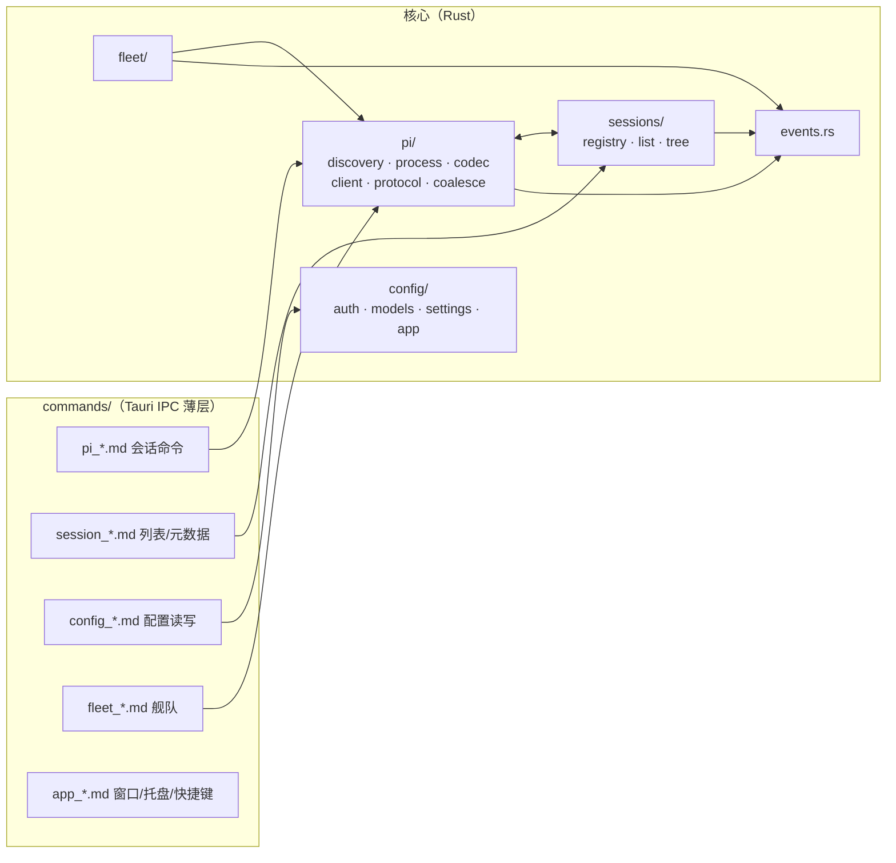

# 03 · 模块划分与接口约定

> 上游：[01-architecture.md](01-architecture.md)、[02-pi-rpc-integration.md](02-pi-rpc-integration.md) · 下游：[08-project-structure.md](08-project-structure.md)

模块划分原则：

1. **单向依赖**：`commands →（pi | sessions | config | fleet）→ 无横向环`；协议类型是唯一共享底层；
2. **IPC 层薄**：Tauri command 只做参数校验与转发，不含业务逻辑；
3. **进程边界清晰**：只有 `pi/process.rs` 允许 spawn/kill；只有 `pi/client.rs` 允许写 stdin。

## 1. 模块总图



## 2. Rust 侧模块（`src-tauri/src/`）

### 2.1 `pi/discovery.rs` — pi 定位与门禁

```rust
pub struct PiBinary { pub path: PathBuf, pub version: Version }
pub fn discover(override: Option<&Path>) -> Result<PiBinary, DiscoveryError>;
pub fn check_compat(v: &Version) -> Compatibility;   // Ok / Warn / Block
```

- 顺序：设置 → `PI_BIN` → **内置 resources**（M2 起，08 §7.1）→ PATH（02 §2.1）；缓存结果，设置变更时重验。

### 2.2 `pi/codec.rs` — JSONL 分帧器

```rust
pub struct JsonlDecoder { buf: Vec<u8> }
impl JsonlDecoder {
    pub fn feed(&mut self, chunk: &[u8], out: &mut Vec<serde_json::Value>); // 字节扫描 b'\n'，剥尾部 \r
    pub fn finish(&mut self, out: &mut Vec<serde_json::Value>);             // EOF 冲刷半行
}
```

- 独立纯函数模块（无 IO），单测覆盖：跨 chunk 半行、`\r\n`、空行【pi 不应输出空行，防御跳过】、>1MB 长行（C7）、非法 JSON 行（计数上报）。
- **选择手写字节扫描而非逐行 BufReader**：`BufRead::read_line` 按字节找 `\n`，语义等同；自管缓冲便于处理 EOF 半行与性能剖析（见 05 §3.1）。

### 2.3 `pi/process.rs` — 进程监督器

```rust
pub struct WorkerHandle {
    pub tab_id: TabId, pub cwd: PathBuf,
    // 内部：Child + stdin 写端 + pending map + 事件订阅
}
pub async fn spawn_worker(args: SpawnArgs) -> Result<WorkerHandle, SpawnError>;
impl WorkerHandle {
    pub async fn send(&self, cmd: Command) -> Result<Response>;      // 02 §3
    pub fn events(&self) -> broadcast::Receiver<PiEvent>;            // 原始事件（合帧前）
    pub async fn shutdown(graceful: Grace) -> ExitStatus;            // 01 §2.3 序列
}
```

- `SpawnArgs { cwd, session: SessionTarget, model: Option<ModelSpec>, name: Option<String>, env_extra }`；
- 状态机（Spawning/Ready/Busy/Recycled/Crashed/Stopped）由本模块维护并广播，registry 与 UI 只消费；
- **stderr**：行缓冲捕获环形缓冲（尾部 256 行），仅用于错误呈现与日志。

### 2.4 `pi/client.rs` — 命令客户端

- id 分配、pending map、超时（02 §3.1）；`bash`/`compact` 长命令不设超时、由取消语义终结；
- 暴露类型化方法：`prompt/steer/follow_up/abort/clear_queue/new_session/switch_session/fork/clone/get_state/get_messages/get_entries/get_tree/set_model/...`（全集见 02 §3.2 表）。

### 2.5 `pi/protocol.rs` — serde 协议类型

- 命令枚举（`#[serde(tag="type")]`）+ 事件枚举 + 消息/内容块/条目类型；
- 一切 Piggy 不消费的字段进 `extra: serde_json::Value`（`flatten`）透传（02 §5.1）；
- 与 `packages/pi-protocol`（TS）保持镜像，CI 里跑**结构对拍测试**（Rust 序列化 ↔ TS zod 解析同一组 JSON fixture）。

### 2.6 `pi/coalesce.rs` — 合帧器（详见 05 §3.2）

```rust
pub struct FrameCoalescer { frame: Frame, deadline: Instant }
pub enum FrameItem {
    TextDelta { content_index: usize, s: String },
    ThinkingDelta { content_index: usize, s: String },
    ToolArgsDelta { content_index: usize, s: String },
    Usage(Usage),                       // 直接换最新值
    Passthrough(PiEvent),               // 非 delta 事件：立即透传，不等待帧
}
```

- 规则：**delta 合并、非 delta 直通**；帧触发条件 = 16ms 到期 或 遇到块边界事件（`*_end`）；进程退出冲刷。

### 2.7 `sessions/registry.rs` — 标签页注册表

```rust
pub struct TabDescriptor {
    pub tab_id: TabId, pub project_cwd: PathBuf,
    pub session_file: Option<PathBuf>,   // 当前绑定
    pub worker: Option<WorkerHandle>,    // 复活语义：None = 已回收
    pub last_cursor: Option<EntryId>,    // §6.4 游标
}
```

- 职责：tab↔worker↔session 三方绑定、会话文件互斥（02 §6.3）、空闲回收计时（订阅各 worker 的 settled 事件）、worker 复活（switch_session + 游标补齐）；
- 事件：`tab-updated` / `worker-state-changed` → 前端。

### 2.8 `sessions/list.rs` — 会话列表

- 扫描 `~/.pi/agent/sessions/**.jsonl` 首行 header + stat（02 §6.2）；按项目分组；
- `notify` watcher（debounce 500ms）→ `session-list-changed` 事件；
- 解析器容错：header 损坏/超旧的 v1 文件 → 仍列出，标记 `legacy`，打开交由 pi 迁移（pi 自动迁移到 v3）。

### 2.9 `sessions/tree.rs` — 树与考古

- `get_tree` 结果缓存（按 leafId 失效）；提供前端分支树视图数据（含 label/branchSummary 条目）。

### 2.10 `config/` — pi 配置文件受控编辑

| 子模块 | 文件 | 提供能力 |
|---|---|---|
| `auth.rs` | `~/.pi/agent/auth.json` | 按 provider 读写 API Key / OAuth 凭据（呈现时脱敏）；删除 = logout |
| `models.rs` | `~/.pi/agent/models.json` | 自定义 provider/模型表单化编辑（baseUrl/api/compat/cost…），保留未知字段 |
| `settings.rs` | `~/.pi/agent/settings.json` + `<cwd>/.pi/settings.json` | 表单化常用项 + 原始 JSON 编辑器；读时合并视图、写时明确目标层级（pi 规则：项目覆盖全局） |
| `app.rs` | Piggy 自有配置（Tauri store） | 键位、外观、worker 上限、空闲回收时长、piPath 等（**绝不存密钥**） |

- 全部**原子写**（tmp + rename），写前备份 `.bak`；JSON 解析失败时进入只读模式 + 提示（保护用户手编内容）；
- OAuth 订阅登录（Claude/ChatGPT/Copilot 等 `/login` 流程）：**M1 阶段**由 GUI 检测 `auth.json` 变化自动刷新状态，登录动作引导用户在终端跑一次 `pi`；**M4** 内嵌 PTY 终端页签（xterm.js）直接在 GUI 内执行 `pi /login`（01 §3.6）。

### 2.11 `open_in_app/` — 「打开方式」（外部应用）

「打开方式」两个档的宿主半边：会话头部（打开**工作区目录**，移植 DSH
`@deepseek-ai/dsh-host-open-in-app`）与文档预览头部（打开**这个文件**，移植 DSH
`native-command/path-opener.ts` + `file-applications.ts`）。五个文件各管一件事：

| 文件 | 职责 |
|---|---|
| `catalog.rs` | **编译期白名单**（34 条）：编辑器/IDE、Git GUI、终端、文件管理器，每条声明按平台依次尝试的定位链 |
| `resolver.rs` | 把定位链解析成"这台机器上**验过的**启动器"（`app` / `xcode` / `cli` / `file` / `app-paths` / `install-record` / `scan` / `github-desktop` / `desktop` / `fixed`），含 `reg.exe` 输出与 `.desktop` 解析 |
| `icons.rs` | 图标提取：macOS `plutil` + `sips` 出 128px PNG；Linux 走 hicolor/pixmaps；**Windows 未实现**（返回 None，前端画通用图标） |
| `paths.rs` | **文件级**那一档：操作系统文件关联（查处理器 + 默认项 + 32px 图标）、`open`/`reveal`/指定应用三个动作。macOS 走 `osascript -l JavaScript` + AppKit `NSWorkspace`（实测 0.4s / 20+ 处理器），Linux 走 `gio info` + `gio mime` + desktop entry，Windows 只做 open/reveal |
| `host.rs` | 宿主事实（platform/home/app_roots/env/ssh）+ `Host` trait（可注入）+ 有超时的宿主命令 + **脱离父进程组、洗净凭据环境**的启动器 |

六个命令：`open_in_app_list` / `open_in_app_icon` / `open_in_app_open`（目录），
`open_path_available` / `open_path_applications` / `open_path_open`（文件，`action = open | reveal`）。

四条不变量（都有测试）：

1. **只报验过的启动器** —— 光有安装记录/注册表项不算，必须落到磁盘上真实存在的文件；
2. **一台机器只解析一次**（进程内缓存），只有"启动时发现可执行文件没了"才重解析那一条；
3. **`open_in_app_open` 只认已解析的启动器 + 已存在的绝对目录**；
4. **`open_path_open` 只认已存在的绝对路径**，且带 `application` 时**先查一遍系统注册列表再启动**
   —— 前端传什么字符串都进不了执行面。这四条合起来才是它敢叫"打开方式"而不是"任意命令执行"的理由。

为什么不用 `tauri-plugin-opener`（11 §2.1 原计划）：那个插件的权限面是"任意路径/任意 URL"，
而这里需要的只是"用白名单应用打开一个已存在的目录/文件"。自建六个窄命令，权限面小得多（08 §6）。

### 2.12 `provider/` — 提供商与模型配置（配置页的宿主半边）

配置页「模型」一节的后端（前端见 04 §2.2）。**它不新增任何配置存储**：读写的都是
`~/.pi/agent/auth.json` / `models.json`（+ 只读 `models-store.json`），写进 pi 的文件，
终端里的 `pi` 立刻就能用。

| 文件 | 职责 |
|---|---|
| `catalog_generated.rs` | **生成物**：pi v0.87.1 的提供商目录（41 条：id / 展示名 / 默认 baseUrl / 默认协议 / 协议全集 / 密钥环境变量）。由 `apps/desktop/scripts/gen-provider-catalog.mjs` 从 pi 源码生成（`types.ts` 的 `KnownProvider`、`providers/all.ts` 的顺序、`providers/*.ts` 的 `createProvider({...})`、`env-api-keys.ts` 的 envMap），`--check` 可复核 |
| `catalog.rs` | 目录查询 + 列举端点规则（Anthropic 系 `{root}/v1/models`，其余 `{base}/models`，抄 DSH `discovery.ts::listingUrl`）+ 结构性测试 |
| `overview.rs` | **总览合成**：`内置目录 ∪ auth.json ∪ models.json ∪ 环境变量` → 一行一个提供商，且每个值都带"从哪来"。密钥来源顺序 = pi 的解析顺序（`provider-composer.ts:347-375`：凭据 > models.json 的 apiKey > 环境变量） |
| `edit.rs` | 写 `models.json` 的 `providers.<id>`：只动界面拥有的字段（name/baseUrl/api/apiKey/models），**未知字段原样保留**；模型行按 id 字段级合并；空串 = 删键（pi 的 schema 对这些键有 `minLength: 1`） |
| `discover.rs` | 「获取可用模型 / 检测」：**本地模型目录优先**（`models-store.json`，不联网），否则真发一次 HTTP 问端点（`reqwest`，15s 超时，4MB 响应上限，`data[]`/`models{}` 两种形状，单行坏数据跳过） |
| `mod.rs` | 六个 Tauri 命令：`provider_overview` / `provider_save` / `provider_set_key` / `provider_remove_key` / `provider_remove` / `provider_discover` |

三条设计要点：

1. **为什么目录要在编译期固化**：pi 的 RPC 没有"列出所有提供商"这条命令
   （`rpc-types.ts` 的 RpcCommand 只有 set_model / cycle_model / get_available_models，
   而 `getAvailableSnapshot()` 只返回**已配置可用**的模型）。配置页恰恰要展示
   "还没配置的那些"，所以目录必须自带；而目录内容必须来自 pi 源码——抄错一个 id，
   用户就会写出一份 pi 认不出的配置（本项目真实踩过：auth.json 的字段名写成 `api_key`）。
2. **密钥来源必须显示**：同一个提供商可以同时存在三处密钥，只有一处生效。
   `keySource` 字段就是给界面显示用的，另有 `hasInlineKey` 用来警告
   "models.json 里那把当前不生效"。
3. **TLS crypto provider 要自己装**：`reqwest` 用的是 rustls 的 no-provider 变体
   （tauri 与 updater 都这么配），不先 `install_default()` 的话 `Client::builder().build()`
   会**直接 panic**（不是返回错误）。`discover.rs` 里按 tauri 自己的做法先装一次。

### 2.13 `fleet/` — 宿主侧舰队编排（详设见 06 §3）

- FleetRun / FleetLane 状态机、模板库（scout/reviewer/worker…）、并行 spawn、steer/中断、结果收集（`get_last_assistant_text` + `agent_settled`）。

### 2.14 `events.rs` — 前端事件总线

统一事件命名（前端 `listen` 的全部通道在此枚举）：

| 通道 | 方向 | 载荷 |
|---|---|---|
| `pi:frame:{tabId}` | → 前端 | 合帧后的增量帧（TextDelta 批等） |
| `pi:commit:{tabId}` | → 前端 | 权威消息/事件（message_end、tool_execution_end…） |
| `pi:state:{tabId}` | → 前端 | worker 状态机迁移 |
| `pi:ui-req:{tabId}` / `pi:ui-req-reply` | → / ← 前端 | Extension UI 子协议（02 §8） |
| `tabs:changed` / `sessions:changed` | → 前端 | 注册表/列表变化 |
| `fleet:event:{runId}` | → 前端 | 舰队状态 |

拆 `frame`（高频、可丢可并）与 `commit`（低频、必达）两通道是渲染分帧（04 §4）与背压策略（05 §3.3）的基础。

## 3. 前端侧模块（`src/`）

### 3.1 `lib/ipc.ts`

- `invoke` 包装：统一错误形态（Rust 侧 `Result<T, AppError>` → TS discriminated union）；
- `listen` 包装：按通道订阅、组件卸载自动清理、`pi:frame:*` 支持 tab 级多播。

### 3.2 `stores/`（zustand）

| store | 内容 | 更新源 |
|---|---|---|
| `tabsStore` | tab 列表、活动 tab、worker 状态 | `tabs:changed`、`pi:state` |
| `messagesStore` | 每 tab 的消息（normalized：`byId` + `ids`）、回合分组、工具卡片状态 | `pi:commit` |
| `liveStore` | **瞬态**：活动实时块的 DOM 直写句柄与块索引（不存文本本体） | `pi:frame`（订阅不渲染，04 §4.3） |
| `sessionsStore` | 会话列表、树缓存 | `sessions:changed`、invoke |
| `settingsStore` | pi 配置合并视图 + Piggy 自有配置 | invoke（写后回读） |
| `fleetStore` | 舰队 run/lane 状态 | `fleet:event` |
| `uiStore` | 弹窗队列、工作区布局（视图开合/尺寸/活动视图，04 §1.8）、视图注册表、键位注册表 | 本地 + Extension UI |

原则：**store 只存结构态与索引，流式文本不进 React 状态**（04 §4）。

### 3.3 `features/chat/` — 转录与输入

- `Transcript`：TanStack Virtual 虚拟化容器；行组件按消息类型分发；
- `MessageView`（自研，antd-free）：user / assistant(text+thinking+toolCall) / toolResult / bashExecution / 未知块；
- `LiveBlock`：流式实时块——rAF 窗口内直接 `appendChild` 文本节点（04 §4.3）；
- `ToolCard`：工具调用卡片（参数摘要、累积输出、diff/图片/文件路径特化渲染）；
- `Composer`：多行输入、图片拖拽/粘贴、斜杠命令自动补全（数据 `get_commands`）、队列 chips、steer/followUp 选择（流式中）。

### 3.4 `features/sessions/`

侧栏（项目分组列表、搜索 `Cmd+Shift+F`）、会话树抽屉（`tree.rs` 数据 → antd Tree + 自绘分支图）、fork/clone/重命名/导出/删除操作（映射 02 §3.2 表）。

### 3.5 `features/settings/`

Provider 管理（API Key 表单 → `auth.rs`；自定义 provider 表单 → `models.rs`；状态检测 = 尝试 `get_available_models`）、模型与 thinking 默认值（→ `settings.rs` 的 defaultProvider/defaultModel/defaultThinkingLevel）、应用设置（外观/键位/资源上限）、原始 JSON 编辑器。

### 3.6 `features/dialogs/` — Extension UI 路由

`pi:ui-req` → 按 method 映射 antd 弹窗（02 §8 表）；**同一 tab 串行队列**；`editor` 用全屏 Drawer + 等宽编辑器。

### 3.7 `features/fleet/` — 舰队面板（06）

Run 列表、lane 卡片（状态/成本/elapsed）、steer 输入、结果收集视图。

### 3.8 `features/workspace/` — 布局骨架

AppFrame 与 LayoutManager 抽象（外框 `react-resizable-panels` + 编辑区 dockview，04 §1.8/10 §）、TabStrip 语义（预览/固定/徽标，dockview tab 定制）、ViewRail/SideBarHost/RightBarHost（viewType 注册制）、PanelHost（终端/输出）、StatusBar；以及 `features/preview/`（文件/diff 预览 tab，MonacoHost 实例池封装，10 §2.3）。

### 3.9 `features/palette/` — 命令面板（07）

命令注册表（所有 UI 动作的唯一 id 来源，键位系统与面板共用）、模糊搜索、chord 冲突提示。

### 3.9 `packages/pi-protocol`（共享 TS 包）

- RPC 命令/事件/消息类型的 zod schema（passthrough）+ 推导类型；
- 与 Rust `protocol.rs` 的 fixture 对拍（08 §5）。

### 3.10 `packages/piggy-bridge`（pi 扩展，06 §4）

发布为独立 npm 包；`pi install` 后为 RPC 会话注入 `/piggy:*` 命令与 widget 流。
