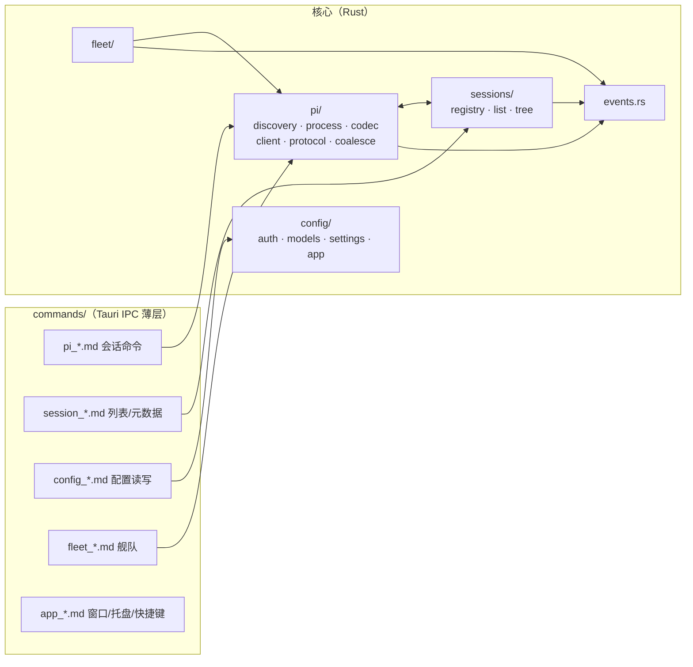

# 03 · 模块划分与接口约定

> 上游：[01-architecture.md](01-architecture.md)、[02-pi-rpc-integration.md](02-pi-rpc-integration.md) · 下游：[08-project-structure.md](08-project-structure.md)

模块划分原则：

1. **单向依赖**：`commands →（pi | sessions | config | fleet）→ 无横向环`；协议类型是唯一共享底层；
2. **IPC 层薄**：Tauri command 只做参数校验与转发，不含业务逻辑；
3. **进程边界清晰**：只有 `pi/process.rs` 允许 spawn/kill；只有 `pi/client.rs` 允许写 stdin。

## 1. 模块总图



## 2. Rust 侧模块（`src-tauri/src/`）

### 2.1 `pi/discovery.rs` — pi 定位与门禁

```rust
pub struct PiBinary { pub path: PathBuf, pub version: Version }
pub fn discover(override: Option<&Path>) -> Result<PiBinary, DiscoveryError>;
pub fn check_compat(v: &Version) -> Compatibility;   // Ok / Warn / Block
```

- 顺序：设置 → `PI_BIN` → **内置 resources**（M2 起，08 §7.1）→ PATH（02 §2.1）；缓存结果，设置变更时重验。

**PATH 里"有 pi"≠"能执行 pi"（Windows 上真机踩到）**：npm/pnpm 在 Windows 的 bin 目录里
**同时**放 `pi`（给 Git Bash 的 POSIX shell 脚本）与 `pi.cmd`（cmd/PowerShell 的垫片）。
老代码先试无扩展名的 `pi` 并把它当结果返回，而**绝对路径 Rust 不会再补 `.exe`**
（见 `std::process::Command` 的平台说明），于是 `CreateProcess` 报
`os error 193（不是有效的 Win32 应用程序）`，界面上就是"pi 未找到——可 pi 明明在 PATH 里"。
现在的规则（`exec_names` / `first_pi_in`）：

- Unix：候选就是 `pi`；
- Windows：按 **`PATHEXT`** 生成候选（默认 `.COM;.EXE;.BAT;.CMD` → `pi.com/pi.exe/pi.bat/pi.cmd`），
  **无扩展名的 `pi` 排最后**，且只在它真的是 PE（`MZ` 头）时才接受——这样 shell 垫片
  永远不会被交给 `CreateProcess`，而"有人把 `pi.exe` 改名成 `pi`"的极端情况仍可用；
- 兜底目录分平台：Windows 是 `%LOCALAPPDATA%\pnpm` / `%APPDATA%\npm` / `~/.local/bin` /
  `~/scoop/shims`，Unix 是原来那五个（老代码只列了 Unix 路径，Windows 上等于没兜底）；
  home 在 Windows 上取 `USERPROFILE`（那里一般不设 `HOME`）。

五条纯函数/夹具测试覆盖这些规则（`exec_names_*`、`windows_prefers_the_cmd_shim_*`、
`windows_ignores_a_lone_posix_shim`、`windows_well_known_dirs_*`），在 macOS 上就能跑。

### 2.2 `pi/codec.rs` — JSONL 分帧器

```rust
pub struct JsonlDecoder { buf: Vec<u8> }
impl JsonlDecoder {
    pub fn feed(&mut self, chunk: &[u8], out: &mut Vec<serde_json::Value>); // 字节扫描 b'\n'，剥尾部 \r
    pub fn finish(&mut self, out: &mut Vec<serde_json::Value>);             // EOF 冲刷半行
}
```

- 独立纯函数模块（无 IO），单测覆盖：跨 chunk 半行、`\r\n`、空行【pi 不应输出空行，防御跳过】、>1MB 长行（C7）、非法 JSON 行（计数上报）。
- **选择手写字节扫描而非逐行 BufReader**：`BufRead::read_line` 按字节找 `\n`，语义等同；自管缓冲便于处理 EOF 半行与性能剖析（见 05 §3.1）。

### 2.3 `pi/process.rs` — 进程监督器

```rust
pub struct WorkerHandle {
    pub tab_id: TabId, pub cwd: PathBuf,
    // 内部：Child + stdin 写端 + pending map + 事件订阅
}
pub async fn spawn_worker(args: SpawnArgs) -> Result<WorkerHandle, SpawnError>;
impl WorkerHandle {
    pub async fn send(&self, cmd: Command) -> Result<Response>;      // 02 §3
    pub fn events(&self) -> broadcast::Receiver<PiEvent>;            // 原始事件（合帧前）
    pub async fn shutdown(graceful: Grace) -> ExitStatus;            // 01 §2.3 序列
}
```

- `SpawnArgs { cwd, session: SessionTarget, model: Option<ModelSpec>, name: Option<String>, env_extra }`；
- 状态机（Spawning/Ready/Busy/Recycled/Crashed/Stopped）由本模块维护并广播，registry 与 UI 只消费；
- **stderr**：行缓冲捕获环形缓冲（尾部 256 行），仅用于错误呈现与日志。

### 2.4 `pi/client.rs` — 命令客户端

- id 分配、pending map、超时（02 §3.1）；`bash`/`compact` 长命令不设超时、由取消语义终结；
- 暴露类型化方法：`prompt/steer/follow_up/abort/clear_queue/new_session/switch_session/fork/clone/get_state/get_messages/get_entries/get_tree/set_model/...`（全集见 02 §3.2 表）。

### 2.5 `pi/protocol.rs` — serde 协议类型

- 命令枚举（`#[serde(tag="type")]`）+ 事件枚举 + 消息/内容块/条目类型；
- 一切 Piggy 不消费的字段进 `extra: serde_json::Value`（`flatten`）透传（02 §5.1）；
- 与 `packages/pi-protocol`（TS）保持镜像，CI 里跑**结构对拍测试**（Rust 序列化 ↔ TS zod 解析同一组 JSON fixture）。

### 2.6 `pi/coalesce.rs` — 合帧器（详见 05 §3.2）

```rust
pub struct FrameCoalescer { frame: Frame, deadline: Instant }
pub enum FrameItem {
    TextDelta { content_index: usize, s: String },
    ThinkingDelta { content_index: usize, s: String },
    ToolArgsDelta { content_index: usize, s: String },
    Usage(Usage),                       // 直接换最新值
    Passthrough(PiEvent),               // 非 delta 事件：立即透传，不等待帧
}
```

- 规则：**delta 合并、非 delta 直通**；帧触发条件 = 16ms 到期 或 遇到块边界事件（`*_end`）；进程退出冲刷。

### 2.7 `sessions/registry.rs` — 标签页注册表

```rust
pub struct TabDescriptor {
    pub tab_id: TabId, pub project_cwd: PathBuf,
    pub session_file: Option<PathBuf>,   // 当前绑定
    pub worker: Option<WorkerHandle>,    // 复活语义：None = 已回收
    pub last_cursor: Option<EntryId>,    // §6.4 游标
}
```

- 职责：tab↔worker↔session 三方绑定、会话文件互斥（02 §6.3）、空闲回收计时（订阅各 worker 的 settled 事件）、worker 复活（switch_session + 游标补齐）；
- 事件：`tab-updated` / `worker-state-changed` → 前端。

### 2.8 `sessions/list.rs` — 会话列表

- 扫描生效会话根下的 `*.jsonl` 首行 header + stat（02 §6.2）；按项目分组；
- **两种布局都认，写的时候也按同一条规则**（Windows 事故当口查出来的）：默认布局
  `<root>/--<cwd 编码>--/<文件>.jsonl`，自定义 `sessionDir` 则是**平铺**在根下的
  （pi 把自定义值当叶子目录用：落盘 `session-manager.ts:1752-1756`、列举
  `listSessionsFromDir` `:941-953` 只读该目录下的 `*.jsonl` 不下钻）。老代码只扫一层子目录，
  且预创建**永远**建 `--<cwd>--` 子目录 → 设了自定义目录的机器上，侧栏空白，
  而 Piggy 建的会话**终端 pi 也看不见**（本机实测：`sessionDir` 指到 `…/tmp/session`，
  根下 88 个 pi 写的平铺文件，`--Users-wxk--/` 子目录里 39 个 Piggy 写的会话）；
  `precreate_dir`（纯函数）+ `sessions_root_spec()` 现在共同保证"写哪儿"与"读哪儿"一致；
- `notify` watcher（debounce 500ms）→ `session-list-changed` 事件；监听根见 §2.18；
- 解析器容错：header 损坏/超旧的 v1 文件 → 仍列出，标记 `legacy`，打开交由 pi 迁移（pi 自动迁移到 v3）。

### 2.9 `sessions/tree.rs` — 树与考古

- `get_tree` 结果缓存（按 leafId 失效）；提供前端分支树视图数据（含 label/branchSummary 条目）。

### 2.10 `config/` — pi 配置文件受控编辑

| 子模块 | 文件 | 提供能力 |
|---|---|---|
| `paths.rs` | —（只算路径） | **主目录 / pi 目录的唯一口径**（§2.18）：`home_dir` / `agent_dir` / `expand_home` / `is_under` |
| `auth.rs` | `~/.pi/agent/auth.json` | 按 provider 读写 API Key / OAuth 凭据（呈现时脱敏）；删除 = logout |
| `models.rs` | `~/.pi/agent/models.json` | 自定义 provider/模型表单化编辑（baseUrl/api/compat/cost…），保留未知字段 |
| `settings.rs` | `~/.pi/agent/settings.json` + `<cwd>/.pi/settings.json` | 表单化常用项 + 原始 JSON 编辑器；读时合并视图、写时明确目标层级（pi 规则：项目覆盖全局） |
| `app.rs` | `~/.piggy/layout.json` · `config.json` | 工作区布局、键位、外观、worker 上限、空闲回收时长、piPath 等（**绝不存密钥**） |

- 全部**原子写**（tmp + rename），写前备份 `.bak`；JSON 解析失败时进入只读模式 + 提示（保护用户手编内容）；
- OAuth 订阅登录（Claude/ChatGPT/Copilot 等 `/login` 流程）：**M1 阶段**由 GUI 检测 `auth.json` 变化自动刷新状态，登录动作引导用户在终端跑一次 `pi`；**M4** 内嵌 PTY 终端页签（xterm.js）直接在 GUI 内执行 `pi /login`（01 §3.6）。

### 2.11 `open_in_app/` — 「打开方式」（外部应用）

「打开方式」两个档的宿主半边：会话头部（打开**工作区目录**，移植 DSH
`@deepseek-ai/dsh-host-open-in-app`）与文档预览头部（打开**这个文件**，移植 DSH
`native-command/path-opener.ts` + `file-applications.ts`）。五个文件各管一件事：

| 文件 | 职责 |
|---|---|
| `catalog.rs` | **编译期白名单**（34 条）：编辑器/IDE、Git GUI、终端、文件管理器，每条声明按平台依次尝试的定位链 |
| `resolver.rs` | 把定位链解析成"这台机器上**验过的**启动器"（`app` / `xcode` / `cli` / `file` / `app-paths` / `install-record` / `scan` / `github-desktop` / `desktop` / `fixed`），含 `reg.exe` 输出与 `.desktop` 解析 |
| `icons.rs` | 图标提取：macOS `plutil` + `sips` 出 128px PNG；Linux 走 hicolor/pixmaps；**Windows 未实现**（返回 None，前端画通用图标） |
| `paths.rs` | **文件级**那一档：操作系统文件关联（查处理器 + 默认项 + 32px 图标）、`open`/`reveal`/指定应用三个动作。macOS 走 `osascript -l JavaScript` + AppKit `NSWorkspace`（实测 0.4s / 20+ 处理器），Linux 走 `gio info` + `gio mime` + desktop entry，Windows 只做 open/reveal |
| `host.rs` | 宿主事实（platform/home/app_roots/env/ssh）+ `Host` trait（可注入）+ 有超时的宿主命令 + **脱离父进程组、洗净凭据环境**的启动器 |

六个命令：`open_in_app_list` / `open_in_app_icon` / `open_in_app_open`（目录），
`open_path_available` / `open_path_applications` / `open_path_open`（文件，`action = open | reveal`）。

四条不变量（都有测试）：

1. **只报验过的启动器** —— 光有安装记录/注册表项不算，必须落到磁盘上真实存在的文件；
2. **一台机器只解析一次**（进程内缓存），只有"启动时发现可执行文件没了"才重解析那一条；
3. **`open_in_app_open` 只认已解析的启动器 + 已存在的绝对目录**；
4. **`open_path_open` 只认已存在的绝对路径**，且带 `application` 时**先查一遍系统注册列表再启动**
   —— 前端传什么字符串都进不了执行面。这四条合起来才是它敢叫"打开方式"而不是"任意命令执行"的理由。

为什么不用 `tauri-plugin-opener`（11 §2.1 原计划）：那个插件的权限面是"任意路径/任意 URL"，
而这里需要的只是"用白名单应用打开一个已存在的目录/文件"。自建六个窄命令，权限面小得多（08 §6）。

### 2.12 `provider/` — 提供商与模型配置（配置页的宿主半边）

配置页「模型」一节的后端（前端见 04 §2.2）。**它不新增任何配置存储**：读写的都是
`~/.pi/agent/auth.json` / `models.json`（+ 只读 `models-store.json`），写进 pi 的文件，
终端里的 `pi` 立刻就能用。

| 文件 | 职责 |
|---|---|
| `catalog_generated.rs` | **生成物**：pi v0.87.1 的提供商目录（41 条：id / 展示名 / 默认 baseUrl / 默认协议 / 协议全集 / 密钥环境变量）。由 `apps/desktop/scripts/gen-provider-catalog.mjs` 从 pi 源码生成（`types.ts` 的 `KnownProvider`、`providers/all.ts` 的顺序、`providers/*.ts` 的 `createProvider({...})`、`env-api-keys.ts` 的 envMap），`--check` 可复核 |
| `catalog.rs` | 目录查询 + 列举端点规则（Anthropic 系 `{root}/v1/models`，其余 `{base}/models`，抄 DSH `discovery.ts::listingUrl`）+ 结构性测试 |
| `overview.rs` | **总览合成**：`内置目录 ∪ auth.json ∪ models.json ∪ 环境变量` → 一行一个提供商，且每个值都带"从哪来"。密钥来源顺序 = pi 的解析顺序（`provider-composer.ts:347-375`：凭据 > models.json 的 apiKey > 环境变量） |
| `edit.rs` | 写 `models.json` 的 `providers.<id>`：只动界面拥有的字段（name/baseUrl/api/apiKey/models），**未知字段原样保留**；模型行按 id 字段级合并；空串 = 删键（pi 的 schema 对这些键有 `minLength: 1`） |
| `discover.rs` | 「获取可用模型 / 检测」：**本地模型目录优先**（`models-store.json`，不联网），否则真发一次 HTTP 问端点（`reqwest`，15s 超时，4MB 响应上限，`data[]`/`models{}` 两种形状，单行坏数据跳过） |
| `mod.rs` | 六个 Tauri 命令：`provider_overview` / `provider_save` / `provider_set_key` / `provider_remove_key` / `provider_remove` / `provider_discover` |

三条设计要点：

1. **为什么目录要在编译期固化**：pi 的 RPC 没有"列出所有提供商"这条命令
   （`rpc-types.ts` 的 RpcCommand 只有 set_model / cycle_model / get_available_models，
   而 `getAvailableSnapshot()` 只返回**已配置可用**的模型）。配置页恰恰要展示
   "还没配置的那些"，所以目录必须自带；而目录内容必须来自 pi 源码——抄错一个 id，
   用户就会写出一份 pi 认不出的配置（本项目真实踩过：auth.json 的字段名写成 `api_key`）。
2. **密钥来源必须显示**：同一个提供商可以同时存在三处密钥，只有一处生效。
   `keySource` 字段就是给界面显示用的，另有 `hasInlineKey` 用来警告
   "models.json 里那把当前不生效"。
3. **TLS crypto provider 要自己装**：`reqwest` 用的是 rustls 的 no-provider 变体
   （tauri 与 updater 都这么配），不先 `install_default()` 的话 `Client::builder().build()`
   会**直接 panic**（不是返回错误）。`discover.rs` 里按 tauri 自己的做法先装一次。

### 2.13 `fleet/` — 宿主侧舰队编排（详设见 06 §3）

- FleetRun / FleetLane 状态机、模板库（scout/reviewer/worker…）、并行 spawn、steer/中断、结果收集（`get_last_assistant_text` + `agent_settled`）。

### 2.14 `events.rs` — 前端事件总线

统一事件命名（前端 `listen` 的全部通道在此枚举）：

| 通道 | 方向 | 载荷 |
|---|---|---|
| `pi:frame:{tabId}` | → 前端 | 合帧后的增量帧（TextDelta 批等） |
| `pi:commit:{tabId}` | → 前端 | 权威消息/事件（message_end、tool_execution_end…） |
| `pi:state:{tabId}` | → 前端 | worker 状态机迁移 |
| `pi:ui-req:{tabId}` / `pi:ui-req-reply` | → / ← 前端 | Extension UI 子协议（02 §8） |
| `tabs:changed` / `sessions:changed` | → 前端 | 注册表/列表变化 |
| `fleet:event:{runId}` | → 前端 | 舰队状态 |
| `plugin:start:{jobId}` / `plugin:log:{jobId}` / `plugin:done:{jobId}` | → 前端 | 插件任务的起跑/逐行输出/收尾（03 §2.15） |

拆 `frame`（高频、可丢可并）与 `commit`（低频、必达）两通道是渲染分帧（04 §4）与背压策略（05 §3.3）的基础。

### 2.15 `plugin/` — 插件管理（配置页的宿主半边）

pi **没有**任何扩展管理 RPC：`modes/rpc/rpc-types.ts:20-74` 那 33 条命令里一条都不沾
（未知类型直接 `Unknown command`），`pi list` 只列 settings 里的包且**没有 `--json`**。
所以"pi 实际会加载哪些插件"只能自己还原，而能做的操作分两条路：

| 操作 | 走哪条路 | 理由 |
|---|---|---|
| 盘点 | 读文件（`inventory.rs`） | 无命令可用；`pi list` 不含 `extensions[]` 与发现目录 |
| 安装 / 删除 / 升级 | `pi install` / `remove` / `update`（`cli.rs`） | 涉及 npm/git 落盘，自己实现必然与 pi 分叉 |
| 启用 / 停用 | 改 `settings.json`（`mod.rs`） | pi 没有非交互命令，唯一入口是 `pi config` 那个 TUI |
| 登记 / 移除本地扩展路径 | 改 `settings.json` 的 `extensions[]` | 同上 |
| 删除发现目录里的条目 | 移到回收站 | pi 对它们没有卸载命令 |

**四个来源与加载优先级**（`core/package-manager.ts:176-192` 的 `resourcePrecedenceRank`）：

| rank | 来源 | 基准目录 |
|---|---|---|
| 0 | 项目 `settings.json` 的 `extensions[]` | `<cwd>/.pi` |
| 1 | 项目发现目录 `.pi/extensions/` | `<cwd>/.pi` |
| 2 | 全局 `settings.json` 的 `extensions[]` | `~/.pi/agent` |
| 3 | 全局发现目录 `~/.pi/agent/extensions/` | `~/.pi/agent` |
| 4 | 包（`packages[]`，npm/git/本地） | 各作用域的 `npm/` `git/` |

同路径被多个来源命中时保留 rank 最小的一条（`package-manager.ts:2585-2593`）。
另有 `-e` 的 CLI 路径排在全部之前，以及 `builtInExtensions`（随 pi 发布、不可增删）。

**发现规则**（`loader.ts:670-744`，只扫一层）：直接文件 `.ts`/`.js`；子目录有
`package.json` 的 `pi.extensions[]` 按它加载；否则取 `index.ts`/`index.js`；都不满足就跳过。

**"停用"在 pi 里是通配符，不是布尔开关**（`package-manager.ts:707-780`）：

| 写法 | 含义 | 匹配 |
|---|---|---|
| `path` | 声明一个资源 | 路径 |
| `!glob` | 排除 | minimatch（相对路径/文件名/绝对路径取或） |
| `+path` | 强制包含（压过 `!`） | **精确**相等 |
| `-path` | 强制排除（压过 `+`） | **精确**相等 |

判定顺序固定 `!` → `+` → `-`（`isEnabledByOverrides`）。**每个来源只受自己那个作用域的
通配符影响**：全局的 `-x` 管不到项目发现目录里的文件。
包的启停另走 `PackageSource` 的对象形式：`autoload:false` + 清掉 `+` 规则 = 不加载。

命令：

| 命令 | 作用 |
|---|---|
| `plugin_overview` | 分组盘点到"哪一层哪条规则定的状态" |
| `plugin_run` | 起 `pi install/remove/update` 任务，返回 `jobId`（输出走 `plugin:log:<id>`） |
| `plugin_jobs` / `plugin_job_cancel` | 任务列表 / 取消（杀子进程） |
| `plugin_set_enabled` | 启用停用（写通配符或 `autoload`） |
| `plugin_add_path` / `plugin_remove_path` | 登记/移除 `extensions[]` 条目 |
| `plugin_delete_discovered` | 把发现目录里的条目移到回收站 |
| `plugin_check_source` | 安装前校验（最重要的一条：裸包名会被 pi 当本地路径） |
| `plugin_project_trust` | 项目是否被 pi 信任（未信任时 `.pi/settings.json` 整份被忽略） |

**生效时机**：已跑起来的 worker 持有旧扩展列表。`/reload` 只在交互式 TUI 里有，
RPC 没有对应命令，所以改动对**新开的会话**生效——界面明示这一点。

`builtins_generated.rs` 由 `scripts/gen-plugin-builtins.mjs` 从 pi 源码的
`builtInExtensions` 生成（`--check` 可核对），因为内置扩展**没有运行时枚举接口**。

### 2.16 `sessions/title.rs` — 会话标题生成

pi **没有**标题生成：`set_session_name` 只负责把名字写进会话文件
（`{"type":"session_info","name":…}`，`session-manager.ts:1316`），谁决定叫什么名字是客户端的事。
所以侧栏此前显示的是回落链（`name` → `first_message` → 文件名）——长会话的第一条消息
往往是一整段话，在 220px 宽的侧栏里被省略号截得没法看。

**为什么是"另起一个一次性 pi 进程"而不是 Piggy 直接发 HTTP**：与插件管理同一条理由
（自己实现必然与 pi 分叉）。标题要用哪个 provider/model、哪把密钥（auth.json /
models.json / 环境变量三级）、走不走代理、`compat` 覆盖、OAuth 刷新——pi 都已经处理好了。

```text
pi -p --no-session -nt -nc [--provider P --model M] [--thinking LEVEL] --system-prompt SYS -- USER
```

| 参数 | 为什么 |
|---|---|
| `-p` | 打印模式：模型正文直接进 stdout，没有 TUI 转义 |
| `--no-session` | **不写会话文件**（实测跑完 sessions 目录多 0 个文件） |
| `-nt` | 不带任何工具（实测 `tools: []`）——起标题不该让模型去读文件 |
| `-nc` | 不读 AGENTS.md/CLAUDE.md（标题与项目上下文无关，读了是噪声） |
| `--thinking` | 可选，见下（档位写错 pi 只警告不报错，所以由 `is_valid_thinking` 把关） |
| `--` | 之后一律当消息：提示词里可能出现以 `-` 开头的粘贴内容 |

**标题不进模型输入**：生成在独立进程里、`--no-session`，所以这段对话完全不进
被命名那个会话的转录。DSH 靠"`session/title` 不是 surface 事件"保证同一件事。

**取材**（`title_source`）：`first`（只看第一条）/ `recent`（只看最近 3 条）/ `both`（默认）。
资格判定与 DSH 同义：**只取人类用户消息里的文本块**，纯图片/工具结果不算；
收拾完为空的那条跳过（否则会基于空内容生成）。

**字数上限按字符算**（`title_max_chars`，默认 20）。这是与 DSH 的**有意差异**：
DSH 用 UTF-8 字节（`maxTitleBytes` 默认 80），于是"20 字节"在中文下只有 6 个字；
用户说的"字数"是字符数。截断用 `chars()`，天然不会切坏多字节字符。

**提示词逐句对齐 DSH**（`session-title-llm/src/index.ts:194-207`），因为那三句各自
挡掉一类真实失败：`plain text … no Markdown/XML/terminal control codes`（否则模型回一段
被 OSC 包住的文本，直接进侧栏就是乱码）、`Use the language of the messages`（中文会话
不能起英文标题）、字数目标。素材装成 **JSON 数组**（DSH 同款）——比自然语言拼接更不容易
被消息里的"忽略上面的指示"越界。

命令：

| 命令 | 作用 |
|---|---|
| `session_title_source` | 列出**会拿什么去生成**（不调用模型，纯读会话文件） |
| `session_title_generate` | 生成并（默认）写进会话名；返回 title/raw/用了哪个模型/思考档/耗时 |
| `title_model_options` | 跑一次 `pi --list-models`，把可用模型交回界面（见下） |

**失败时绝不覆盖旧名字**：模型没给出可用标题（收拾后为空）时返回错误并**保留原名字**，
这是这块最可能造成的数据损坏。生成失败的原因（密钥过期、模型名写错）取自 pi 的
stderr 最后一行。

模型选择（`pick_model`，纯函数）：设置覆盖 > 会话最后一次 `model_change` > 都不给
（让 pi 用默认）。**成对生效**——只给一半会退化成错配组合，宁可都不传。

"成对"这条不是洁癖，是实测出来的：用本地假服务器分别试过四种组合——

| 传了什么 | pi 的反应 |
|---|---|
| `--provider fake --model think-model`（对） | 正常，请求打到 `think-model` |
| `--provider nope --model think-model`（provider 错） | **退出码 1**：`Error: Unknown provider "nope". Use --list-models to see available providers/models.`（这句话会被 Piggy 原样显示） |
| `--provider fake --model no-such-model`（模型名错） | 照发，`model` 字段就是那个不存在的名字，由提供商报错 |
| `--provider nope`（**只给 provider、不给 model**） | ⚠️ **不报错**：悄悄用默认模型把活干完（这就是"成对生效"要挡掉的那一种） |

预览界面显示的"会用哪个模型"用的是**真正会被调用的那个**（`modelUsed` + `modelSource`
= override / session / default / invalid）；覆盖写成半截时 `modelSource = "invalid"`
并带上 `modelError`——生成时它会直接失败，预览**不能**说成"用默认"。

#### 思考强度（`title_thinking`）

界面上是"标题模型"旁边的一个下拉，落到命令行就是 `--thinking <level>`。
档位清单**照抄 pi**（`cli/args.ts:60` 的 `VALID_THINKING_LEVELS`，7 个），
Rust 与前端各写一份、互为金标：
`sessions/title.rs::THINKING_LEVELS` ↔ `src/lib/thinking.ts::THINKING_LEVELS`。

为什么必须自己校验一遍：**pi 对不认识的档位不报错**——只在 stderr 打一行
`Warning: Invalid thinking level "…"` 然后**静默用默认档**继续跑（真机验证过）。
也就是说拼错一个字母 = 用户以为设了、实际没设，界面上完全看不出区别。
所以 `clamp()`（读配置时）丢掉非法值、`perf_config_save`（写配置时）直接报错。

**pi 还会按模型能力再收敛一次**（`clampThinkingLevel`），这一步客户端看不到：
用本地假服务器抓请求体实测（同一台机器上跑真 pi 0.87.1）——

| 模型声明 | 请求的档位 | 实际发出的 `reasoning_effort` |
|---|---|---|
| 无 `thinkingLevelMap`（普通推理模型） | 不传 | `medium`（pi 的默认） |
| 同上 | `high` | `high` |
| 同上 | `xhigh` / `max` | **`high`**（没声明 → 降到支持的最高档） |
| `{xhigh: "xhigh", low: null}` | `xhigh` | `xhigh`（声明了才真的发出去） |
| 同上 | `low` | **`medium`**（声明为不支持 → 往上找） |
| `reasoning: false` | `max` | 无 `reasoning_effort` 字段（降到 `off`，**不报错**） |

界面据此做了两件事：选了不支持推理的模型时把档位**禁用并写明原因**；
选了档位时说明"pi 还会按模型声明的能力收敛一次"（不然就是静默失效）。

#### 模型列表从哪儿来（`title_model_options`）

"标题模型"是**全局设置**，而 pi 的 `get_available_models` 是**会话级**命令
（Piggy 的 `pi_get_available_models` 必须带 `tabId`）——打开设置页时可能一个标签页都没有。
所以走 CLI：`pi --list-models`，它取的是同一个 `ModelRuntime.getAvailable()`
（`cli/list-models.ts:37`），只是不需要会话。真机实测 **0.6s**。

pi **没有** `--json`，所以只能解析那张给人看的表（列间两个及以上空格：
`provider / model / context / max-out / thinking / images`）。这是本功能里最容易随 pi
升级悄悄坏掉的一块，因此：表头按**首两列字面量**识别（不靠"第一行是表头"）、
认不出的行**跳过不猜**、`thinking` 列不是 `yes`/`no` 就整行丢掉（列错位时不会把 `1M`
当成推理能力）、一个都没解析出来时把 **pi 的原话**交给界面显示（`note`）。
真输出当金标锁在 `parses_the_real_list_models_table`；`real_machine_lists_models_from_pi`
（`--ignored`）会真的去跑这台机器上的 pi。

### 2.17 `legal.rs` — 许可与第三方声明

GPLv3 §0 给「Appropriate Legal Notices」下了定义：交互界面必须显示
**①版权声明 ②无担保声明 ③可以按本许可再分发 ④怎么看许可全文**；§5(d) 要求
**有交互界面**的作品都显示它。所以光在仓库里放一份 `LICENSE` 不够——用户拿到的是安装包。

两道出口，一个界面：

| 出口 | 平台 | 内容 |
|---|---|---|
| 系统菜单「许可与第三方声明」 | macOS 在 **App 菜单「关于」正下方**；其它平台在 Help | 只负责"找得到"：亮出窗口 + 发 `app:open-about` |
| 「关于 Piggy 与许可」对话框（前端 `AboutDialog`） | 全平台（另有命令面板、侧栏版本号两个入口） | 负责"看得全"：版权 / 无担保 / 许可名 + **GPLv3 全文** + 第三方组件表 |

**为什么系统「关于」面板不够**：那是个信息框，能显示版权行与一小段 credits，塞不下
674 行原文。所以 `bundle.copyright`（tauri.conf.json）让原生面板显示版权，
全文落在应用内——后者才是 §0 那句 *how to view a copy of this License*。

**菜单是"扩展"而不是"重搭"**：`install_app_menu` 从 `tauri::Menu::default` 出发，
只往 App 子菜单插一条。自己从零搭菜单会让**标准 Edit 子菜单消失 → ⌘C/⌘V/⌘A 在整个应用里失效**，
而这种坏法在界面上完全看不出来（只有用户想复制一段回复时才发现）。
`tests/menu_smoke.rs`（`harness = false`，因为 muda 只能在主线程建菜单）锁三件事：
菜单能建起来、许可条目在「关于」正下方、**Edit 子菜单仍是 7 项**。
实测结构：`App 子菜单 = [predefined:About, item:legal-notices, …]`。

**GPL 原文是嵌进来的**：`include_str!("../../../../LICENSE")` 指向仓库根那一份
（编译期嵌入，零漂移），它的 sha256 由 `src/test/license.test.ts` 锁着
（= 与 gnu.org 逐字节一致）。第三方清单 `THIRD_PARTY` 与 `THIRD_PARTY_NOTICES.md`
**双向对拍**（`third_party_matches_the_notices_file`）：只查单向会漏掉
"文档里登记了、界面（和安装包）里没有"——那正是署名漏掉的方式。

命令：

| 命令 | 作用 |
|---|---|
| `legal_notices` | 返回版权 / 无担保 / 许可名 / **GPLv3 全文** / 第三方表；版本号取自 `package_info()`（= Cargo.toml，不是前端写死的那个） |

### 2.18 `config/paths.rs` — 主目录 / pi 目录的唯一口径

**它为什么存在**：Windows 默认**不设 `HOME`**（只有 Git Bash/MSYS 会设）。老代码十几处
各自 `var_os("HOME")`，于是同一台机器上一起炸出四种毛病：

| 症状 | 机制 |
|---|---|
| 默认会话目录变成 `.pi/agent\sessions`（用户报的） | `HOME` 缺失 → `unwrap_or_default()` 得到**空路径** → `join(".pi/agent")` 退化成**相对路径**，且字面量里的 `/` 与 `join` 补的 `\` 混在一起 |
| 新建会话报「无法确定 cwd」 | `tab_create` 的 cwd 回退只看 `HOME` → 拿不到目录 → 直接报错 |
| 设置/布局存不下来 | `~/.piggy` 同样退化成**相对路径**，落到进程 cwd（装在 Program Files 下还没写权限） |
| 文件预览**沙箱失效** | `starts_with("")` **恒为真**（实测 `Path::new("/etc/passwd").starts_with("") == true`）→ 任意文件可读 |

现在的规则（全部对齐 pi 自己：`getAgentDir()` 走 Node `os.homedir()`）：

- **主目录**：Windows `USERPROFILE` → `HOMEDRIVE`+`HOMEPATH` → `HOME`（Git Bash 兜底）；
  其它平台 `HOME` → `USERPROFILE` → `HOMEDRIVE`+`HOMEPATH`。空串/纯空白一律当**未设置**
  （`set USERPROFILE=` 这类残留必须与"没设"同义）；
- **agent 目录**：`PI_CODING_AGENT_DIR` 优先（`config.ts:528-534`，支持 `~`），否则 `<home>/.pi/agent`；
- **`~` 展开**：只认 `~` 与 `~/…`，Windows 上多认 `~\…`（`utils/paths.ts:88-95`）；
  主目录未知时**原样返回**（宁可让 `is_dir()` 报错，也不要展开成空路径=当前目录）；
- **分隔符纪律**：跨平台路径**只准用 `Path::join` 拼**，字面量里不许写分隔符。
  这条在 macOS/Linux 上**测不出来**（`join(".pi/agent")` 与 `join(".pi").join("agent")`
  在 Unix 上产生完全相同的字符串），所以由 `tests/path_separators.rs` 静态守：
  扫 `src/**/*.rs`，注释、`join("/")` 归一化、含空格的显示分隔符、`#[cfg(test)]` 之后的
  夹具都豁免；
- **主目录未知 = 拒绝服务而不是降级**：`fs_preview_read` 直接报错（沙箱不能"看不见就当没限制"），
  `agent_dir` 给相对 `.pi/agent` 并打一行警告。

**会话根的优先级**（`pi_files::resolve_sessions_root`，逐条照 `main.ts:675-679`）：
`--session-dir` 旗标（Piggy 不用，它总是显式 `--session <文件>`）→
`PI_CODING_AGENT_SESSION_DIR` → `settings.json` 的 `sessionDir` → 默认 `<agent>/sessions`。
**只认绝对路径**：相对值在 pi 那边随项目 cwd，扫描器枚举不了，于是回退默认并在 UI 标成默认。
设置页「当前生效」现在同时给出 `source`（`default` / `settings` / `env`）——
这次事故里光看 `dir` 分不清"默认值坏了"还是"自定义值被吞了"。

守卫清单（都能在 macOS 上跑）：`home_from` 的四条环境形状、`agent_dir` 的环境覆盖、
`~` 展开的六种输入、`is_under` 的空 home 拒绝、`resolve_sessions_root` 的四条分支、
以及一个**端到端探针**——起子进程抹掉 `HOME` 只留 `USERPROFILE`，跑真正的
`agent_dir()` / `sessions_root()`，断言默认目录仍是绝对路径（红检时它如实打印出
`probe sessions=.pi/agent/sessions`，就是用户看到的那一幕）。

## 3. 前端侧模块（`src/`）

### 3.0 `lib/paths.ts` — 路径字符串（前端半边）

Rust 侧给界面的路径是**平台原生**的（`to_string_lossy()`，Windows 上就是 `C:\Users\x\proj`），
而界面过去到处 `split('/')`，于是 Windows 上项目分组标题、标签页标题、右栏根名一律显示
**整条路径**，Monaco 也认不出 `Makefile`（`lastIndexOf('/')` 返回 -1）。现在统一走
`baseName` / `splitPath` / `lastSeparator`（`/` 与 `\` 都算分隔符）；
`src/test/paths.test.ts` 用 Windows、POSIX、混合分隔符、UNC、末尾分隔符五组输入锁住。

### 3.1 `lib/ipc.ts`

- `invoke` 包装：统一错误形态（Rust 侧 `Result<T, AppError>` → TS discriminated union）；
- `listen` 包装：按通道订阅、组件卸载自动清理、`pi:frame:*` 支持 tab 级多播。

### 3.1b `features/chat/turnRailItems.ts` + `TurnRail.tsx` — 预览滚动条（docs/04 §2.6）

`buildRailItems`（纯函数）把转录的行切成**回合**：每个 user 行开启新的一轮，
其后到下一个 user 行之间的 assistant 文本都归这一轮；开头不是 user 的行
（恢复出来的半截会话）不造刻度。`activeTurnOf` 算"阅读线在哪一轮"。
组件侧用与转录同一个虚拟化库只渲染可视刻度（几千轮也不会重排）。

配置 `transcript_rail`（`off`/`left`/`right`，默认右）存在 `PerfConfig` 里，
前端由 `stores/appConfig.ts` 持有——转录要读它，而设置页改完必须让**已打开**的会话
立刻跟着变（这是它进 store 的唯一理由）。

### 3.2 `stores/`（zustand）

| store | 内容 | 更新源 |
|---|---|---|
| `tabsStore` | tab 列表、活动 tab、worker 状态 | `tabs:changed`、`pi:state` |
| `messagesStore` | 每 tab 的消息（normalized：`byId` + `ids`）、回合分组、工具卡片状态 | `pi:commit` |
| `liveStore` | **瞬态**：活动实时块的 DOM 直写句柄与块索引（不存文本本体） | `pi:frame`（订阅不渲染，04 §4.3） |
| `sessionsStore` | 会话列表、树缓存 | `sessions:changed`、invoke |
| `settingsStore` | pi 配置合并视图 + Piggy 自有配置 | invoke（写后回读） |
| `fleetStore` | 舰队 run/lane 状态 | `fleet:event` |
| `uiStore` | 弹窗队列、工作区布局（视图开合/尺寸/活动视图，04 §1.8）、视图注册表、键位注册表 | 本地 + Extension UI |

原则：**store 只存结构态与索引，流式文本不进 React 状态**（04 §4）。

### 3.3 `features/chat/` — 转录与输入

- `Transcript`：TanStack Virtual 虚拟化容器；行组件按消息类型分发；
- `MessageView`（自研，antd-free）：user / assistant(text+thinking+toolCall) / toolResult / bashExecution / 未知块；
- `LiveBlock`：流式实时块——rAF 窗口内直接 `appendChild` 文本节点（04 §4.3）；
- `ToolCard`：工具调用卡片（参数摘要、累积输出、diff/图片/文件路径特化渲染）；
- `Composer`：多行输入、图片拖拽/粘贴、斜杠命令自动补全（数据 `get_commands`）、队列 chips、steer/followUp 选择（流式中）。

### 3.4 `features/sessions/`

侧栏（项目分组列表、搜索 `Cmd+Shift+F`）、会话树抽屉（`tree.rs` 数据 → antd Tree + 自绘分支图）、fork/clone/重命名/导出/删除操作（映射 02 §3.2 表）。

### 3.5 `features/settings/`

Provider 管理（API Key 表单 → `auth.rs`；自定义 provider 表单 → `models.rs`；状态检测 = 尝试 `get_available_models`）、模型与 thinking 默认值（→ `settings.rs` 的 defaultProvider/defaultModel/defaultThinkingLevel）、应用设置（外观/键位/资源上限）、原始 JSON 编辑器。

### 3.6 `features/dialogs/` — Extension UI 路由

`pi:ui-req` → 按 method 映射 antd 弹窗（02 §8 表）；**同一 tab 串行队列**；`editor` 用全屏 Drawer + 等宽编辑器。

### 3.7 `features/fleet/` — 舰队面板（06）

Run 列表、lane 卡片（状态/成本/elapsed）、steer 输入、结果收集视图。

### 3.8 `features/workspace/` — 布局骨架

AppFrame 与 LayoutManager 抽象（外框 `react-resizable-panels` + 编辑区 dockview，04 §1.8/10 §）、TabStrip 语义（预览/固定/徽标，dockview tab 定制）、ViewRail/SideBarHost/RightBarHost（viewType 注册制）、PanelHost（终端/输出）、StatusBar；以及 `features/preview/`（文件/diff 预览 tab，MonacoHost 实例池封装，10 §2.3）。

### 3.9 `features/palette/` — 命令面板（07）

命令注册表（所有 UI 动作的唯一 id 来源，键位系统与面板共用）、模糊搜索、chord 冲突提示。

### 3.9 `packages/pi-protocol`（共享 TS 包）

- RPC 命令/事件/消息类型的 zod schema（passthrough）+ 推导类型；
- 与 Rust `protocol.rs` 的 fixture 对拍（08 §5）。

### 3.10 `packages/piggy-bridge`（pi 扩展，06 §4）

发布为独立 npm 包；`pi install` 后为 RPC 会话注入 `/piggy:*` 命令与 widget 流。
